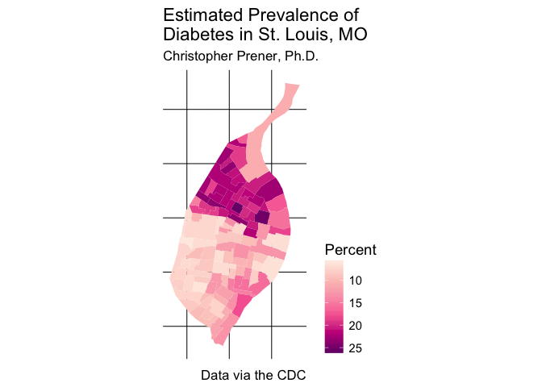

Lab 08 Replication
================
Christopher Prener, Ph.D.
(March 18, 2018)

Introduction
------------

This is an replication notebook for Lab-08 from the course SOC 4650/5650: Introduction to GISc.

Load Dependencies
-----------------

The following code loads the package dependencies for our analysis:

``` r
# tidyverse packages
library(ggplot2)       # data plotting
library(dplyr)         # data wrangling
```

    ## 
    ## Attaching package: 'dplyr'

    ## The following objects are masked from 'package:stats':
    ## 
    ##     filter, lag

    ## The following objects are masked from 'package:base':
    ## 
    ##     intersect, setdiff, setequal, union

``` r
library(readr)         # work with csv files

# other packages
library(ggthemes)      # map theme
library(here)          # file path management
```

    ## here() starts at /Users/chris/GitHub/SOC5650/LectureRepos/lecture-09/assignments/lab-08/lab-08-replication

``` r
library(RColorBrewer)  # color ramps
library(sf)            # spatial data tools
```

    ## Linking to GEOS 3.6.1, GDAL 2.1.3, proj.4 4.9.3

Load Data
---------

We'll use one data set from the `stlData` package and one from this week's mini data release to practice table joins: census tract geometric data and the estimated percent of residents per tract with diabetes. Both are added here:

``` r
library(stlData)
stlTracts <- stl_sf_tracts
diabetes <- read_csv(here("data", "STL_HEALTH_Diabetes.csv"))
```

    ## Parsed with column specification:
    ## cols(
    ##   state = col_character(),
    ##   city = col_character(),
    ##   tract_fips = col_double(),
    ##   year = col_double(),
    ##   question = col_character(),
    ##   estimate = col_double()
    ## )

Part 2
------

### Question 2

Before completing the join, we need to both identify the proper identification variables to base the join on and make sure they are the same type. In `stlTracts`, like all census geography data, the `GEOID` variable is the standard variable for completing joins. We test it using the `class()` function:

``` r
class(stlTracts$GEOID)
```

    ## [1] "character"

In `diabetes`, the `tract_fips` variable looks similar to `GEOID`. We test it using the same `class()` function:

``` r
class(diabetes$tract_fips)
```

    ## [1] "numeric"

Since we have one character and one numeric variable, we need to convert one of them to be the other's type. Here, I'll convert the `tract_fips` variable to character using `mutate()` combined with `as.character()`:

``` r
diabetes <- mutate(diabetes, tract_fips = as.character(tract_fips))
```

Now we have identically formatted variables to base the join off of.

### Question 3

Next, we use `left_join()` to complete the table join:

``` r
stlDiabetes <- left_join(stlTracts, diabetes, by = c("GEOID" = "tract_fips"))
```

We now have a single table named `stlDiabetes` that has both the geometric data and the tabular data combined. With these data in a single table, we can proceed to mapping diabetes rates.

### Question 4

The following code produces a `ggplot` map of the diabetes rates data. We use `RColorBrewer` for a palatte and `ggthemes` for its clean `theme_map()`. Finally, we use the `labs()` function to apply appropriate labeling.

``` r
ggplot() +
  geom_sf(data = stlDiabetes, mapping = aes(fill = estimate), color = NA) +
  scale_fill_distiller(palette = "RdPu", trans = "reverse", name = "Percent") +
  theme_map(base_size = 14) +
  theme(legend.position = "right") +
  labs(
    title = "Estimated Prevalence of \nDiabetes in St. Louis, MO",    
    subtitle = "Christopher Prener, Ph.D.",
    caption = "Data via the CDC"
  )
```



We can see from the map that elevated diabetes rates, sometimes approaching a quarter of the population, are concentrated in North St. Louis.

We'll fnish this section of the lab by saving the map to our results section:

``` r
ggsave(here("results", "stl-diabetes.png"), dpi = 300)
```

    ## Saving 7 x 5 in image
