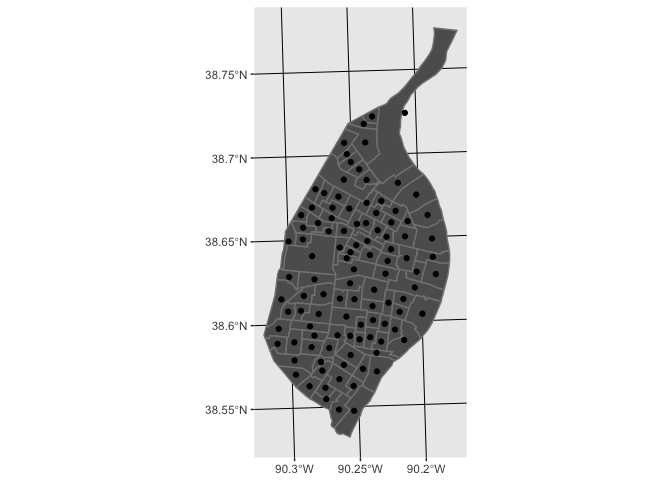

Lecture 09 Extras - Calculating Centroids in R
================
Christopher Prener, Ph.D.
(March 18, 2018)

Introduction
------------

This is an extra notebook for Lecture-09 from the course SOC 4650/5650: Introduction to GISc. It introduces the steps for calculating polygon centroids in `R`, which were not covered in class.

Load Dependencies
-----------------

The following code loads the package dependencies for our analysis:

``` r
library(ggplot2)       # data plotting
library(sf)            # spatial data tools
```

    ## Linking to GEOS 3.6.1, GDAL 2.1.3, proj.4 4.9.3

Load Data
---------

We'll use one data set from the `stlData` package: census tract geometric data. It is added here:

``` r
library(stlData)
tracts <- stl_sf_tracts
```

Fix Projection
--------------

We cannot complete spatial joins using `sf` unless we are using a projected coordinate system. We haven't covered fixing this yet, but we'll make the adjustment before continuing. We can see the current coordinate system by using the `st_crs()` function:

``` r
st_crs(tracts)
```

    ## Coordinate Reference System:
    ##   EPSG: 4269 
    ##   proj4string: "+proj=longlat +ellps=GRS80 +towgs84=0,0,0,0,0,0,0 +no_defs"

The EPSG value `4269` is NAD 1983, which is a *geographic* coordinate system. We'll conver our data to the UTM 15N *projected* coordinate system to allow us to calculate centroids. The EPSG value for this system is `26915`:

``` r
tracts <- st_transform(tracts, crs = 26915)
```

We now have `tracts` data that we can use for calculating centroids. We'll cover the mechanics of how this works next week!

Calculating Centroids
---------------------

We use the `st_centroid()` function to calculate the centroid positions:

``` r
tractCentroids <- st_centroid(tracts)
```

What is returned is an `sf` object that is `POINT` rather than `POLYGON`. Each point represents the geometric center of each polygon. We can see these by layering the centroids on top of the tract boundaries:

``` r
ggplot() + 
  geom_sf(data = tracts, fill = "#5d5d5d", color = "#838383") +
  geom_sf(data = tractCentroids)
```



Each tract has its own centroid, and it is usually easy to see how the centroid sits in the middle of each polygon. Occasionally we get odd findings, like the centroid for the northern-most tract in the city. Not only is the centroid outside of the polygon itself, but it is actually in Illinois. This is one tricky aspect of calculating centroids with irregularly shaped polygons - they sometimes result in odd pairings.
