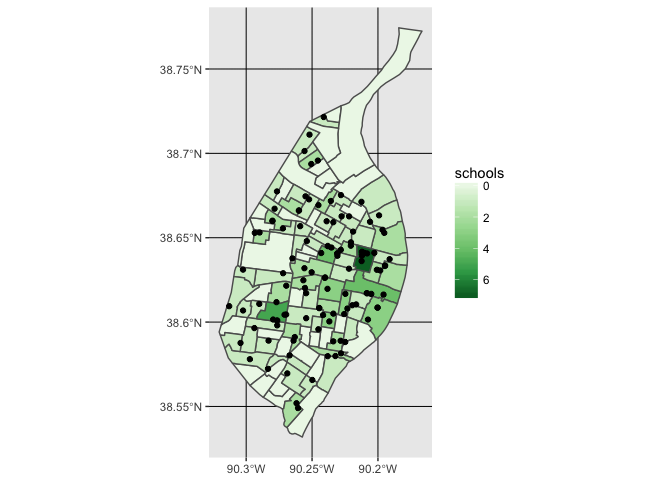

Lecture 09 Extras - Spatial Joins in R
================
Christopher Prener, Ph.D.
(March 18, 2018)

Introduction
------------

This is an extra notebook for Lecture-09 from the course SOC 4650/5650: Introduction to GISc. It introduces spatial joins in `R`, which were not covered in class.

Load Dependencies
-----------------

The following code loads the package dependencies for our analysis:

``` r
library(assertthat)    # comparison testing
library(ggplot2)       # data plotting
library(dplyr)         # data wrangling
```

    ## 
    ## Attaching package: 'dplyr'

    ## The following objects are masked from 'package:stats':
    ## 
    ##     filter, lag

    ## The following objects are masked from 'package:base':
    ## 
    ##     intersect, setdiff, setequal, union

``` r
library(here)          # file path management
```

    ## here() starts at /Users/chris/GitHub/SOC5650/LectureRepos/lecture-09

``` r
library(RColorBrewer)  # color ramps
library(sf)            # spatial data tools
```

    ## Linking to GEOS 3.6.1, GDAL 2.1.3, proj.4 4.9.3

Load Data
---------

We'll use one data set from the `stlData` package and one from this week's mini data release to practice spatial joins: census tract geometric data and the locations of public schools. Both are added here:

``` r
library(stlData)
stlTracts <- stl_sf_tracts
stlEdu <- st_read(here("data", "STL_EDU_Public", "STL_EDU_Public.shp"), stringsAsFactors = FALSE)
```

    ## Reading layer `STL_EDU_Public' from data source `/Users/chris/GitHub/SOC5650/LectureRepos/lecture-09/data/STL_EDU_Public/STL_EDU_Public.shp' using driver `ESRI Shapefile'
    ## Simple feature collection with 112 features and 22 fields
    ## geometry type:  POINT
    ## dimension:      XY
    ## bbox:           xmin: 733975.1 ymin: 4270293 xmax: 744483.2 ymax: 4289490
    ## epsg (SRID):    26915
    ## proj4string:    +proj=utm +zone=15 +datum=NAD83 +units=m +no_defs

Fix Projection
--------------

We cannot complete spatial joins using `sf` unless the coordinate systems are identical. We haven't covered fixing this yet, but we'll make the adjustment before continuing. We haven't covered fixing this yet, but we'll make the adjustment before continuing. We can see the current coordinate system by using the `st_crs()` function:

``` r
st_crs(stlEdu)
```

    ## Coordinate Reference System:
    ##   EPSG: 26915 
    ##   proj4string: "+proj=utm +zone=15 +datum=NAD83 +units=m +no_defs"

The EPSG value `26915` is the UTM 15N *projected* coordinate system.

``` r
st_crs(stlTracts)
```

    ## Coordinate Reference System:
    ##   EPSG: 4269 
    ##   proj4string: "+proj=longlat +ellps=GRS80 +towgs84=0,0,0,0,0,0,0 +no_defs"

The EPSG value `4269` is NAD 1983, which is a *geographic* coordinate system. We'll convert our `stlEdu` data to the NAD 1983 system for this notebooks:

``` r
stlEdu <- st_transform(stlEdu, crs = 4269)
```

We now have `stlEdu` data that we can use for spatial joins. We'll cover the mechanics of how this works next week!

Spatial Joins
-------------

In class, we covered three types of spatial joins. `sf` has tools that allows you to complete two of these three joins: polygon to point and point to polygon. Unfortunately, there is not an accessible way to complete point to point spatial joins at this time.

### Polygon to Point

The more straightforward of the two joins are the polygon to point joins. These are joins where we want to apply the attributes of a polygon to each point within it. We can use `st_join()` to complete this task:

``` r
schoolsWithTract <- st_join(stlEdu, stlTracts)
```

    ## although coordinates are longitude/latitude, st_intersects assumes that they are planar

The first of the two `sf` objects (in this case `stlEdu`) should always be your point data, and the second (in this case `stlTracts`) should contain your polygon data. What we get is a combined data set with **all** of the attributes from `stlTracts` appended to the appropriate schools:

``` r
glimpse(schoolsWithTract)
```

    ## Observations: 112
    ## Variables: 35
    ## $ CtyDist    <chr> "115115", "115914", "115115", "115115", "115115", "...
    ## $ SchNum     <chr> "4420", "6972", "5960", "5970", "4780", "4880", "61...
    ## $ SchID      <chr> "115115-4420", "115914-6972", "115115-5960", "11511...
    ## $ Facility   <chr> "Columbia Elem. Comm. Ed. Center", "Kipp Wisdom Aca...
    ## $ Address    <chr> "3120 St. Louis Avenue", "2647 Ohio Ave", "5000 Dav...
    ## $ Address2   <chr> NA, NA, NA, NA, NA, NA, NA, NA, NA, NA, NA, NA, NA,...
    ## $ City       <chr> "St. Louis", "St. Louis", "St. Louis", "St. Louis",...
    ## $ State      <chr> "MO", "MO", "MO", "MO", "MO", "MO", "MO", "MO", "MO...
    ## $ ZIP        <chr> "631061122", "631181533", "631202319", "631162922",...
    ## $ County     <chr> "St. Louis City", "St. Louis City", "St. Louis City...
    ## $ Phone      <chr> "3145332750", "3143849561", "3143831829", "31448185...
    ## $ FAX        <chr> "3145344062", "8889750072", "3143832292", "31435122...
    ## $ BGrade     <chr> "PK", "K", "PK", "PK", "PK", "PK", "PK", "PK", "04"...
    ## $ EGrade     <chr> "06", "02", "06", "05", "05", "06", "05", "05", "08...
    ## $ Principal  <chr> "Ms. Deshonda  Payton", "Mr. Jacob Shiffrin", "Ms. ...
    ## $ PrinTitle  <chr> "Prin.", "School Leader", "Prin.", "Prin.", "Prin."...
    ## $ Teachers   <dbl> 20, 14, 18, 35, 29, 28, 32, 27, 18, 19, 25, 19, 16,...
    ## $ Enrollment <dbl> 202, 315, 222, 429, 348, 297, 337, 270, 224, 147, 2...
    ## $ Email      <chr> "DESHONDA.PAYTON@SLPS.ORG", "jshiffrin@kippstl.org"...
    ## $ Latitude   <dbl> 38.65354, 38.60479, 38.69361, 38.56951, 38.65301, 3...
    ## $ Longitude  <dbl> -90.21893, -90.22563, -90.25070, -90.26887, -90.289...
    ## $ Loc_Code   <chr> "MAP_MU", "MAP", "MAP_MU", "MAP_MU", "MAP_MU", "MAP...
    ## $ STATEFP    <chr> "29", "29", "29", "29", "29", "29", "29", "29", "29...
    ## $ COUNTYFP   <chr> "510", "510", "510", "510", "510", "510", "510", "5...
    ## $ TRACTCE    <chr> "127100", "123100", "107400", "101300", "105200", "...
    ## $ GEOID      <chr> "29510127100", "29510123100", "29510107400", "29510...
    ## $ NAME       <chr> "1271", "1231", "1074", "1013", "1052", "1257", "10...
    ## $ NAMELSAD   <chr> "Census Tract 1271", "Census Tract 1231", "Census T...
    ## $ MTFCC      <chr> "G5020", "G5020", "G5020", "G5020", "G5020", "G5020...
    ## $ FUNCSTAT   <chr> "S", "S", "S", "S", "S", "S", "S", "S", "S", "S", "...
    ## $ ALAND      <chr> "1741414", "1031109", "1085096", "1974056", "831271...
    ## $ AWATER     <chr> "0", "0", "0", "0", "0", "190785", "0", "0", "0", "...
    ## $ INTPTLAT   <chr> "+38.6505840", "+38.6112805", "+38.6958807", "+38.5...
    ## $ INTPTLON   <chr> "-090.2110908", "-090.2251864", "-090.2505968", "-0...
    ## $ geometry   <sf_geometry [degree]> POINT (-90.21886 38.65362), POINT ...

This is a messy data frame. Often, what we really need are just the identification variables (in this case `TRACTCE` or `GEOID`), so we are better off using `select()` to reduce the variables down to only what is needed:

``` r
stlTracts %>%
  select(GEOID) %>%
  st_join(stlEdu, .) -> schoolsWithTract
```

    ## although coordinates are longitude/latitude, st_intersects assumes that they are planar

By using `st_join()` within a pipe, and referencing where we want the `stlTracts` data included using `.`, we can cut down our tracts data that will be added to `stlEdu` to the bare minimum:

``` r
glimpse(schoolsWithTract)
```

    ## Observations: 112
    ## Variables: 24
    ## $ CtyDist    <chr> "115115", "115914", "115115", "115115", "115115", "...
    ## $ SchNum     <chr> "4420", "6972", "5960", "5970", "4780", "4880", "61...
    ## $ SchID      <chr> "115115-4420", "115914-6972", "115115-5960", "11511...
    ## $ Facility   <chr> "Columbia Elem. Comm. Ed. Center", "Kipp Wisdom Aca...
    ## $ Address    <chr> "3120 St. Louis Avenue", "2647 Ohio Ave", "5000 Dav...
    ## $ Address2   <chr> NA, NA, NA, NA, NA, NA, NA, NA, NA, NA, NA, NA, NA,...
    ## $ City       <chr> "St. Louis", "St. Louis", "St. Louis", "St. Louis",...
    ## $ State      <chr> "MO", "MO", "MO", "MO", "MO", "MO", "MO", "MO", "MO...
    ## $ ZIP        <chr> "631061122", "631181533", "631202319", "631162922",...
    ## $ County     <chr> "St. Louis City", "St. Louis City", "St. Louis City...
    ## $ Phone      <chr> "3145332750", "3143849561", "3143831829", "31448185...
    ## $ FAX        <chr> "3145344062", "8889750072", "3143832292", "31435122...
    ## $ BGrade     <chr> "PK", "K", "PK", "PK", "PK", "PK", "PK", "PK", "04"...
    ## $ EGrade     <chr> "06", "02", "06", "05", "05", "06", "05", "05", "08...
    ## $ Principal  <chr> "Ms. Deshonda  Payton", "Mr. Jacob Shiffrin", "Ms. ...
    ## $ PrinTitle  <chr> "Prin.", "School Leader", "Prin.", "Prin.", "Prin."...
    ## $ Teachers   <dbl> 20, 14, 18, 35, 29, 28, 32, 27, 18, 19, 25, 19, 16,...
    ## $ Enrollment <dbl> 202, 315, 222, 429, 348, 297, 337, 270, 224, 147, 2...
    ## $ Email      <chr> "DESHONDA.PAYTON@SLPS.ORG", "jshiffrin@kippstl.org"...
    ## $ Latitude   <dbl> 38.65354, 38.60479, 38.69361, 38.56951, 38.65301, 3...
    ## $ Longitude  <dbl> -90.21893, -90.22563, -90.25070, -90.26887, -90.289...
    ## $ Loc_Code   <chr> "MAP_MU", "MAP", "MAP_MU", "MAP_MU", "MAP_MU", "MAP...
    ## $ GEOID      <chr> "29510127100", "29510123100", "29510107400", "29510...
    ## $ geometry   <sf_geometry [degree]> POINT (-90.21886 38.65362), POINT ...

This is still an extensive data set, but is more manageable than one created with `st_join()` alone!

### Point to Polygon

This type of join, giving us a count of the number of schools per census tract, is a bit more difficult to implement. We need three functions layered within each other to accomplish this:

-   `st_covers(polygon, points)` returns a count of the number of `points` within each `polygon` as a list
-   `length()` converts the list to a vector
-   `mutate()` allows us to append this vector to our existing `sf` object

``` r
schoolsByTract <- mutate(stlTracts, schools = lengths(st_covers(stlTracts, stlEdu)))
```

    ## although coordinates are longitude/latitude, st_covers assumes that they are planar

We can "check" the results of this join by layering schools over the count data:

``` r
ggplot() +
  geom_sf(data = schoolsByTract, mapping = aes(fill = schools), color = "#5d5d5d") +
  geom_sf(data = stlEdu) +
  scale_fill_distiller(palette = "Greens", trans = "reverse")
```



Simplifying Point to Polygon Joins
----------------------------------

We can write a simple function that simplifies the implementation:

``` r
st_count <- function(polygon, points, countVar){
  
  newData <- mutate(polygon, count = lengths(st_covers(polygon, points)))
  
}
```

The `function()` function creates our new function `st_count()`. We articulate two arguments to be called: `polygon` (the `sf` polygon object) and `points` (the `sf` points object). Then, in the body of the function, we replicate our `mutate()` call from above, but we insert the argument names (`polygon` and `points`) as variables. We'll keep things simple and create a new variable called `count` each time.

``` r
functionTest <- st_count(polygon = stlTracts, points = stlEdu)
```

    ## although coordinates are longitude/latitude, st_covers assumes that they are planar

We can use the `are_equal()` function from `assertthat` to demonstrate that the data created by our function are equal to the data created manually with `mutate()` previously:

``` r
are_equal(schoolsByTract$schools,functionTest$count)
```

    ## [1] TRUE

Since this returns `TRUE`, we have replicated our earlier effort!
